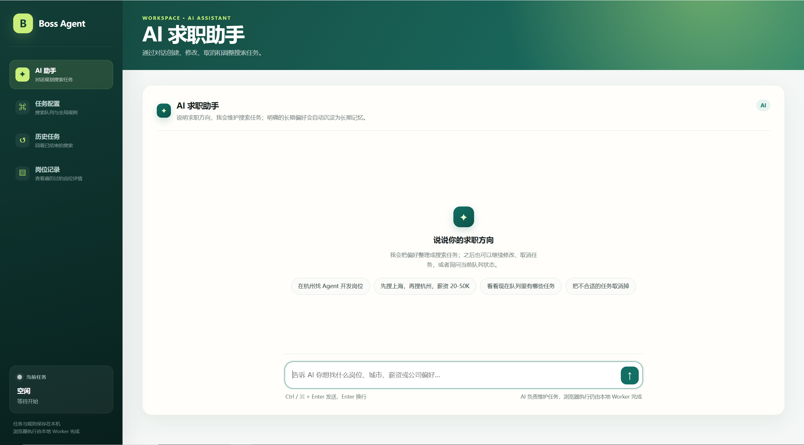
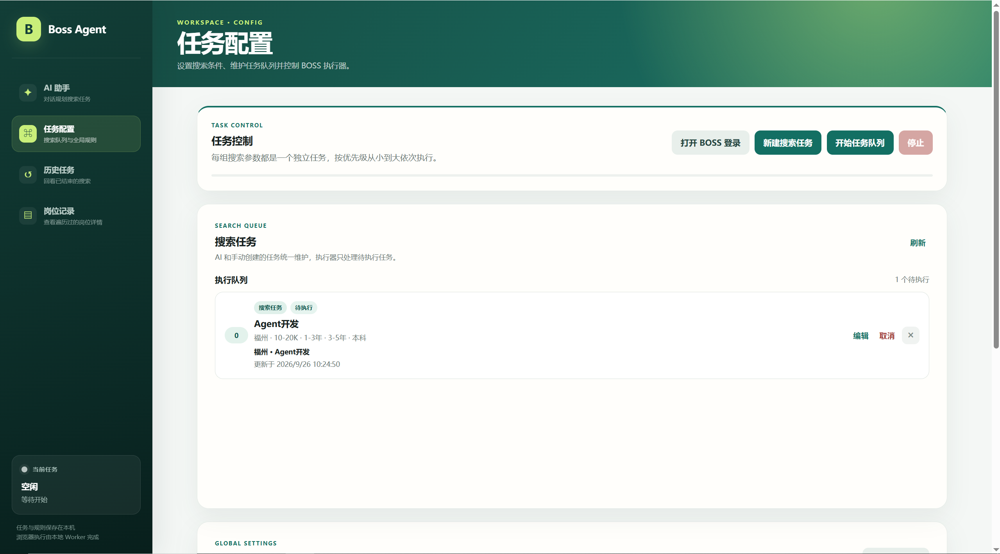

# boss-seek-agent

一个以“Agent 维护求职任务 + 确定性浏览器执行”为核心的 BOSS 求职 Agent。

## 安装与启动

项目使用 [uv](https://docs.astral.sh/uv/) 管理 Python 环境和依赖。

首次拉取项目或依赖发生变化后，执行：

```bash
uv sync
```

`uv sync` 会根据 `pyproject.toml` 和 `uv.lock` 创建/更新项目的 `.venv`，并安装 `boss-seek-agent` 命令入口。

启动项目：

```bash
uv run boss-seek-agent
```

默认监听：

```text
127.0.0.1:8000
```

## 使用

启动后打开：

```text
http://127.0.0.1:8000/
```

首次使用时，可在前端点击“打开 BOSS 登录”手工完成登录。浏览器登录状态会保存在项目的 `runtime/profile/` 目录，后续启动会自动复用。

开发调试接口：

```text
http://127.0.0.1:8000/docs
http://127.0.0.1:8000/health
```

运行测试：

```bash
uv run pytest -q
```

Pytest 的临时目录已固定到项目 `runtime/pytest`，避免 Windows 用户临时目录权限导致测试失败。

## 当前边界

- Agent 负责理解自然语言、维护搜索任务、更新长期求职画像。
- Agent 不直接操作浏览器，也不自行构造 BOSS code。
- `JobSeekTaskService` 负责任务创建、修改、取消、重新入队和优先级。
- `BossSearchConfigCompiler` 只负责把人类语义选项转换成 BOSS 请求 code。
- `JobSeekExecutionService` 负责整个 Worker 的启动、停止和执行状态。
- `JobSeekWorker` 顺序领取 `pending` 任务并维护任务状态。
- `BossJobExecutor` 负责搜索、岗位遍历、详情抓取、过滤和打招呼。
- `RuyiPageBrowser` 只封装浏览器运行时、持久化 profile 和基础页面操作。
- `CandidateProfile` 是 Agent 内部长期记忆，不提供用户直接编辑的 HTTP 页面/API。

## 搜索参数

最终执行参数与 BOSS 浏览器请求保持一致：

```text
query
city
jobType
salary
experience
degree
industry
scale
stage
```

`jobType` 和 `salary` 为空时表示不限，不会附加到搜索 URL。多选字段为空列表时同样不会附加。

所有搜索选项统一来自 `data/search_options.json`。当前数据包含完整城市和细分行业，以及求职类型、薪资、经验、学历、规模和融资阶段等 BOSS 真实语义选项。

Agent 不接收 374 个城市和 146 个行业的完整列表。每轮上下文只注入较小的固定枚举（`jobType`、`salary`、`experience`、`degree`、`scale`、`stage`）及字段规则；城市或行业不确定时，通过 `search_boss_options` Tool 查询合法语义名称。Compiler、前端 Options API 和 Agent 共用同一份数据源。

## 任务执行

```text
JobSeekExecutionService
        ↓
JobSeekWorker
        ↓
BossJobExecutor
        ↓
RuyiPageBrowser
```

执行器只消费 `pending` 任务，并按 `priority` 从小到大执行；相同优先级按创建时间排序。

任务状态：

```text
pending → running → completed
                  ↘ failed
                  ↘ stopped
pending/running → cancelled
```

历史任务不可修改或删除。`requeue` 会复制出新的 `pending` 任务，原历史记录保持不变。

停止执行器时会先请求 Worker 正常退出；超过 10 秒后会强制取消后台任务，避免浏览器调用卡住导致停止接口无限等待。

## 岗位记录

每次成功获取 `job/detail.json` 后都会写入 `job_records`。

岗位优先使用详情接口中的：

```text
zpData.jobInfo.encryptId
```

作为稳定岗位标识。同一岗位重复遇到时更新已有记录并增加访问次数，不重复插入。

岗位记录包含职位、公司、薪资、地点、招聘者、活跃状态、访问次数、是否沟通、是否已经由本 Agent 打过招呼、未打招呼原因，以及完整详情 JSON。

如果本地已经记录该岗位打过招呼，后续搜索再次遇到时会直接跳过，避免重复沟通。

岗位列表接口只返回摘要；完整描述和原始详情在用户展开单条岗位记录时按需获取。

## 主要接口

```text
POST   /api/chat

GET    /api/job-seek-tasks
GET    /api/job-seek-tasks/options
POST   /api/job-seek-tasks
PATCH  /api/job-seek-tasks/{task_id}
DELETE /api/job-seek-tasks/{task_id}
POST   /api/job-seek-tasks/{task_id}/cancel
POST   /api/job-seek-tasks/{task_id}/requeue

GET    /api/job-records
GET    /api/job-records/{record_id}

GET    /api/global-config
PATCH  /api/global-config

GET    /api/execution
POST   /api/execution/start
POST   /api/execution/stop
POST   /api/execution/browser/open
```

长期画像不提供 `/api/profile`。Agent 通过内部 Tool 调用 `CandidateProfileService` 读取和更新长期记忆。

## 数据库

默认 SQLite：

```text
boss-seek-agent.db
```

主要表：

```text
search_tasks
job_records
candidate_profile
global_config
chat_messages
schema_migrations
```

项目启动时先执行 `Base.metadata.create_all()` 创建缺失表，再按照 `schema_migrations` 版本顺序执行一次性数据迁移。

当前 migration 包括：

1. 旧搜索任务字段名迁移到真实 BOSS 请求参数名。
2. 旧版 `jobType="0"` / `salary="0"` 和多选字段中的 `"0"` 迁移成当前空值语义。

## 浏览器

RuyiPage 使用项目本地 Firefox runtime 和固定 profile：

```text
runtime/
├─ browsers/
└─ profile/
```

首次使用可以通过前端“打开 BOSS 登录”手工登录。只要不删除 `runtime/profile/`，后续会复用登录状态。

## 配置

`.env` 示例：

```env
APP_NAME=boss-seek-agent
DATABASE_URL=sqlite:///./boss-seek-agent.db
LLM_API_KEY=
LLM_BASE_URL=https://api.deepseek.com
LLM_MODEL=deepseek-flash
WORKER_AUTOSTART=false
BROWSER_RUNTIME_DIR=runtime/browsers
BROWSER_PROFILE_DIR=runtime/profile
BROWSER_HEADLESS=false
```

## 运行效果





## License / 许可证

本项目采用 **PolyForm Noncommercial License 1.0.0 + 单独商业授权** 的授权模式。

- ✅ 允许个人学习、研究、实验和其他符合许可证条款的非商业使用。
- ✅ 允许在非商业用途范围内修改和分发代码，但必须遵守 [`LICENSE`](./LICENSE) 中的完整条款。
- ❌ 未经作者事先书面授权，不允许用于企业商业业务、收费 SaaS、商业产品集成、收费部署/定制/咨询、商业转售等商业用途。
- 💼 如需商业使用，请先阅读 [`COMMERCIAL_LICENSE.md`](./COMMERCIAL_LICENSE.md) 并联系作者取得单独商业授权。

商业授权联系：2629439590@qq.com  
GitHub：<https://github.com/dengcanhui>

> Commercial use requires a separate commercial license from the author in advance.

完整非商业许可证：[`LICENSE`](./LICENSE)  
商业授权说明：[`COMMERCIAL_LICENSE.md`](./COMMERCIAL_LICENSE.md)
